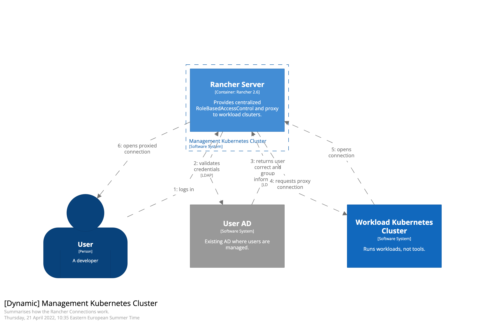

# Connect to running service flow

## Summary
1: User logs into Rancher

2: Rancher validated credentials with AD provider

3: AD Provider approves login, and provides group information

4: Rancher Server requests reverse proxy connection from rancher agent

5: Rancher Agent reads the request, and opens the reverse proxy

6: Rancher server opens the proxied connection for the user
