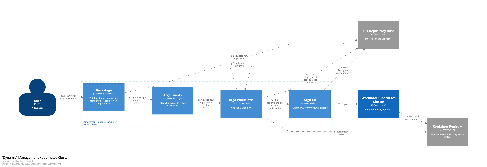

# Create a new app flow

## Summary
1: Developer opens backstage and clicks on "create new app". The dialog will ask for name, which template to use, etc

2: Backstage initializes a new repository in GIT

3: Backstage populated the new repository based on selected template and values

4: Backstage triggers Argo with an event once the repository is created and populated with initial data

5: Argo events will recieve the trigger, and create a new workflow

6: ArgoWorkflow will pull the source code from GIT

7: ArgoWorkflow will build the app, and a container image with the app

8: ArgoWorkflow will push the image to the container registry

9: ArgoWorkflow will create a deployment configuration in GIT

10: ArgoWorkflow will link the deployment config in GIT to a deployment job in ArgoCD

11: ArgoCD will sync the deployment config from GIT

12: ArgoCD will deploy the container with the new app in the workload cluster, and keep it in sync with the GIT repo settings