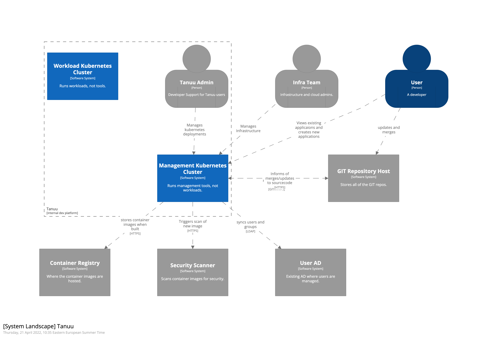
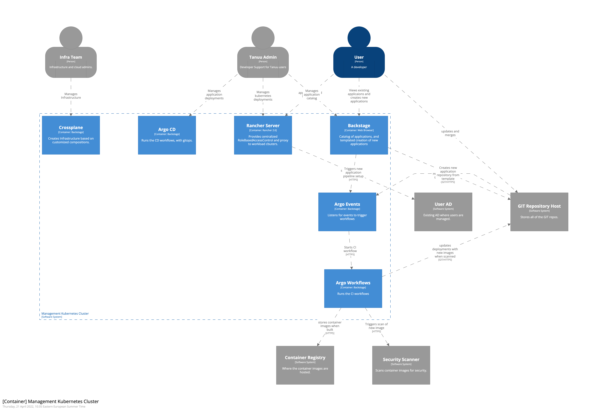

# IDP
Internal Development Platform

## Overview
Firstly, what Tanuu is not. It's not a product, but a template of already available Free and Open Source Software. These components can be replaced with equivelents, based on specific needs. 

The objective of Tanuu is be a pre-integrated solution template of an Internal Development Platform. This IDP can be used to create new apps from a template. App created will have a structured GIT repository, build and deployment pipelines, as well as one-click connection to the deployed app. The aim is to have all pipelines created, application built and deployed, available to developer within 10 minutes of clicking 'create new app'.

IDP will also ensure all new SW updates are automatically built, tested, and deployed using the preset pipelines. Developers can focus on creating value in the apps, not spending time on setting up how to run the apps.

## System Landscape

## Management Cluster

## Use Case Flows
[Create New App](CreateNewApp.md)

[Update an App](UpdateApp.md)

[Connect to Apps](ConnectToApps.md)

## Component descriptions
None of the solutions listed are absolute lock-ins, all could be replaced or changed with other options.
The structure of the workflows and content of the templates are the key value creators, and main IPR.

### Rancher (v2.6.0) FOSS
Used primarily for the cenralized RBAC configuration of all k8s access, auditing of the access, and the transparent proxy of remote connections.

Rancher automates adding users (based on AD groups) in kubernetes clusters, and removes the need to manually adding users to new environments.
All access to kubernetes would be managed via Rancher, and based only on AD group membership. Multifactor authentication set in AD would apply to all connections to environments.
Rancher also allows users to use a reverse proxy tunnel to applications running inside isolated managed environments, without need for complex SSH tunneling or firewall updates.
Rancher also maintains an audit log of all connections and actions, to every environment, by every user.

### Backstage (v1.0.0) FOSS
Replaces manual cloning of git repository, and editing of settings/options for each new app with a templated model, including also the pipeline generation.

Initially a template creation tool. Automated documentation and link generation may be added.
Backstage will not be essential to deployed applications. It is used primarily for instantiating new applications based on templates, and visibilty of the overall catalogs.

### Argoworkflows/events (v3.3.1) FOSS
The primary job orchestration engine. Used for running the CI, building containers, running automated tests, security scans, and triggering deployments.

Due to its native kubernetes mindset and baseline, this replaces jenkins workflows with a modern, simplified, more atomic feature set.

### ArgoCD (v2.3.3) FOSS
Used to keep k8s in sync with git repo, managing kubernetes as gitops.

Ensures that environments are always running in sync with defined state in GIT, without cron style 'check' jobs. The kubernetes/gitops model allows 'self healing' of environments, as the kubernetes contoller will be checking actual vs desired state (as defined in git) and always updating to desired. This improves uptime and reliability, and gives greater visibility to the actual state of environments.

### Crossplane (v1.7.0) FOSS
Crossplane is a kubernetes custom resource defenition tool, allowing complex and elaborate kubernetes dependencies and objects be defined in a short consise yaml file.
A kubernetes application deployment consists of several kubernetes objects: Deployment, Service, Horizontal Pod Autoscaller, Ingress, ConfigMaps, Secrets, and possibly more. Crossplane allows defines all of these, according to policies and best practices of the organization, and exposes them in a simple consice few lines of yaml, which is all the developers need to define.
