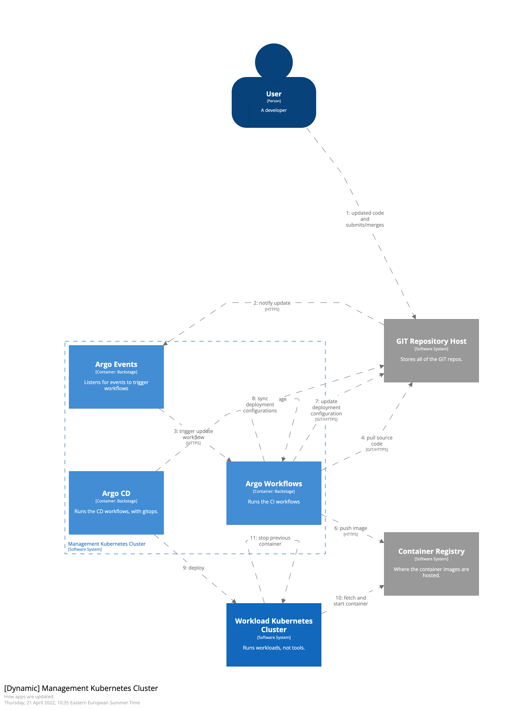

# Update an app flow

## Summary
1: Developer makes updates to app locally, and syncs them to GIT repo

2: Merge in GIT triggers notification to ArgoEvents

3: ArgoEvents will start a pipeline job in ArgoWorkflows

4: ArgoWorkflows pulls the new source code

5: ArgoWorkflow will build the app, and a container image with the app

7: ArgoWorkflow will push the image to the container registry

7: ArgoWorkflow will update the deployment configuration in GIT

8: ArgoCD will sync the deployment config from GIT

9: ArgoCD will deploy the container with the new app in the workload cluster

10: Workload cluster will fetch the image from Container Registry

11: Worload cluster will start new image, and stop old one, based on deployment rules
